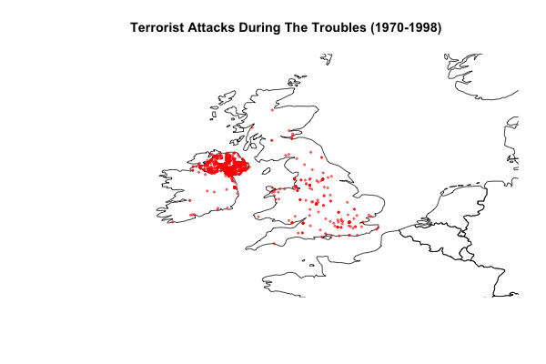
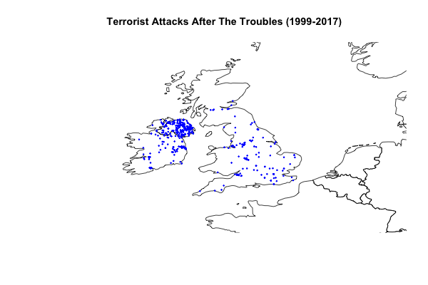
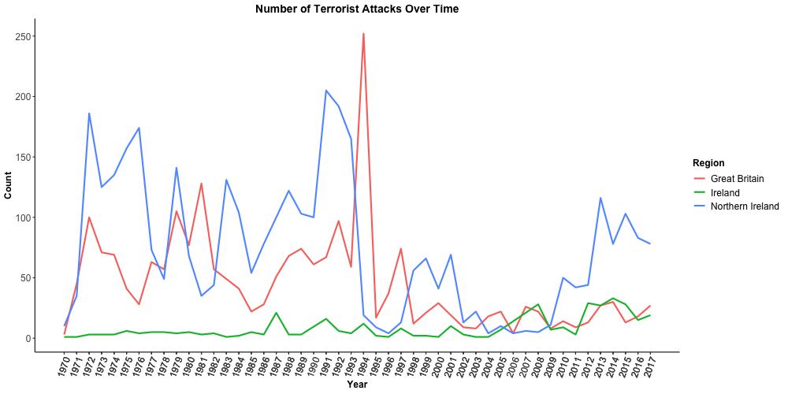
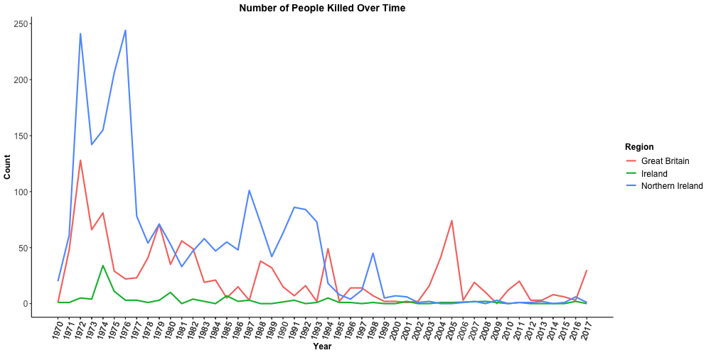
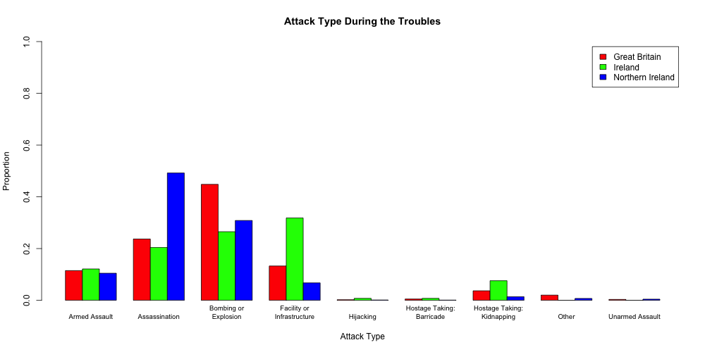
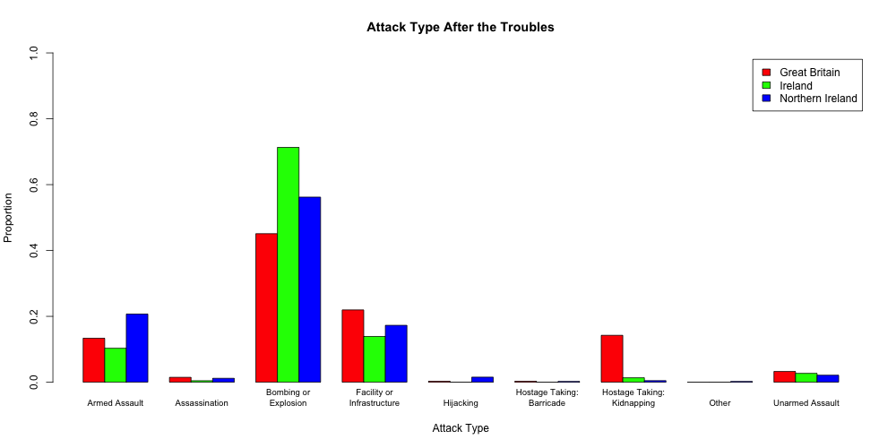
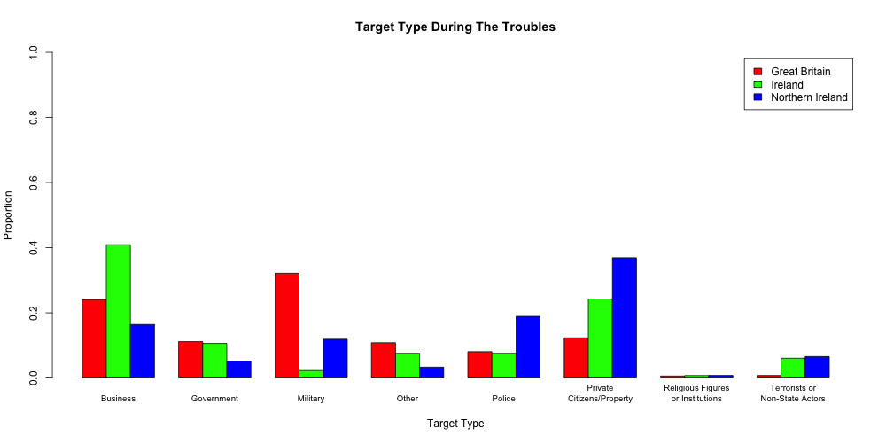
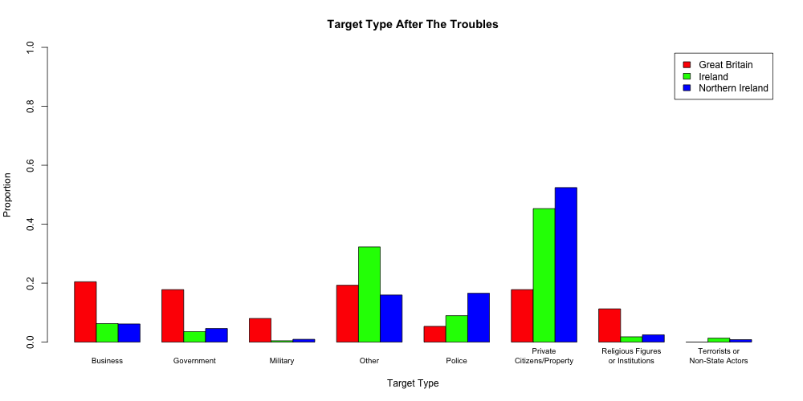

# **Using the Global Terrorism Database to Understand The Troubles**
## Jane Stout, Ph.D.

[The Troubles] was an ethno-nationalist conflict that took place mainly in Northern Ireland and to some degree in the Republic of Ireland and Great Britain. Although the conflict is generally believed to have taken started in 1968 and ended with the [Good Friday Agreement] of 1998, intra-regional violence persists to this day throughout the Republic of Ireland and the United Kingdom (UK).

The [Global Terrorism Database] (GTD) serves as a viable source to study regional violence during and after The Troubles. Curated by The National Consortium for the Study of Terrorism and Responses to Terrorism (START), the GTD contains information on terrorist attacks that have been documented in the news since 1970. The GTD serves as the source for all analyses reported on here.

### Geospatial Analysis
I plotted the geospatial location of attacks throughout the UK during The Troubles (Figure 1a) and during the period after The Troubles (Figure 1b). Both Figures show a high density of attacks in Northern Ireland and a smattering of attacks throughout the UK.

**Figure 1a. Terrorist Attack Locations During The Troubles**

**Figure 1b. Terrorist Attack Locations After The Troubles**

### Terrorism Over Time

Figure 2a displayed the number of attacks in The Republic of Ireland, Northern Ireland, and Great Britain over time. Here, we see a great deal of violence in Northern Ireland during The Troubles and nearly comparable levels of violence in Great Britain. Not surprisingly, fatalities due to terrorism correlate with the prevalence of terrorist attacks over time (see Figure 2b). Although terrorist attacks have been less prevalent since 1998, there has been a noteable uptick in recent years in Northern Ireland. However, fatalities in Northern Ireland due to terrorism in recent years is low.

**Figure 2a. Terrorist Attacks Over Time by Region**.

**Figure 2b. Fatalities Due to Terrorist Attacks Over Time by Region**.

### Characteristics of Terrorism

The GTD allows us to look at several characteristics of terrorist attacks over time and by region. Figures 3a and 3b show the type of attacks that took place by region during and after The Troubles, respectively. Specifically, these figures show the proportion of attack type within each region. For instance, during The Troubles in Northern Ireland, approximately 50% of attacks were via assassination and 30% were via bombing or explosions.

It interesting to observe differences in terrorist behavior during versus after The Troubles. One noteable difference is that assassinations were used at a similar rate as bombings or explosions during The Troubles. After The Troubles, bombings and explosions became the predominant form of terrorism across all regions.

**Figure 3a. Proportion of Attack Types by Region During The Troubles**

**Figure 3b. Proportion of Attack Types by Region After The Troubles**.

The GTD also allows us to look at the specific targets of terrorist attacks. Figures 4a and 4b show a few interesting patterns. For one, businesses were a prime target in Ireland during but not after The Troubles. In Great Britain, however, while the military was a primary target during The Troubles, this was no longer the case after The Troubles. The main target for Northern Ireland has been and is currently private citizens and property.

**Figure 4a. Proportion of Target Types by Region During The Troubles**

**Figure 4b. Proportion of Target Types by Region After The Troubles**

### Terrorism in 2017

Table 1 displays terrorist activity by organization and by region in 2017. Recently, terrorist activity is highest in Northern Ireland and groups that have been identified are those that do not agree with the accord of 1998 (e.g., Dissident Republicans, The New Irish Republican Army). In contrast, terrorist activity in Great Britain mainly relates to international relations with the Muslim community.

Interestingly, very few organizations actually claimed responsibilty for their attacks in 2017: 13% of attackers in Northern Ireland, 14% in Great Britain, and 0 in Ireland.

Table 2 displays damage caused by attacks in 2017 by region. Attacks in Great Britain in 2017 were the most harmful, as 69% of attacks resulted in property damage, 202 people were wounded and 30 people were killed. In compareison, 43% of attacks in Northern Ireland resulted in property damage, 28 people wounded, and 1 person killed. In Ireland, only 22% of attacks resulted in property damage, 1 person was wounded, and there were no fatalities.

**Table 1. Terrorist Organization Activity by Region in 2017**

| Region           | Count | Organization                                |
|------------------|-------|---------------------------------------------|
| Great Britain    | 14    | Unknown                                     |
| Great Britain    | 5     | Anti-Muslim extremists                      |
| Great Britain    | 5     | Loyalists                                   |
| Great Britain    | 2     | Islamic State of Iraq and the Levant (ISIL) |
| Great Britain    | 1     | Muslim extremists                           |
| Ireland          | 18    | Unknown                                     |
| Ireland          | 1     | Dissident Republicans                       |
| Northern Ireland | 50    | Unknown                                     |
| Northern Ireland | 10    | Dissident Republicans                       |
| Northern Ireland | 6     | The New Irish Republican Army               |
| Northern Ireland | 4     | Oglaigh na hEireann                         |
| Northern Ireland | 3     | Ulster Freedom Fighters (UFF)               |
| Northern Ireland | 3     | Ulster Volunteer Force (UVF)                |
| Northern Ireland | 1     | Arm na Poblachta' (Army of the Republic)    |
| Northern Ireland | 1     | South East Antrim Brigade                   |

**Table 2. Damage Caused by Attacks in 2017 by Region**

| Region           | % Caused Property Damage | Number Wounded | Number Killed |
|------------------|--------------------------|----------------|---------------|
| Great Britain    | 69%                      | 202            | 30            |
| Ireland          | 22%                      | 1              | 0             |
| Northern Ireland | 43%                      | 28             | 1             |

### Summary

The GTD serves as an excellent resource to learn about terrorist activity throughout the world. This report focused on conflict in the The Republic of Ireland and UK. [My code] was written in R and can readily be adapted to focus on conflict in others countries and other timeframes.

[The Troubles]: https://en.wikipedia.org/wiki/The_Troubles
[Good Friday Agreement]: https://en.wikipedia.org/wiki/Good_Friday_Agreement
[Global Terrorism Database]: https://www.start.umd.edu/gtd/about/
[My code]:https://github.com/gagejane/Troubles/blob/master/code.R
